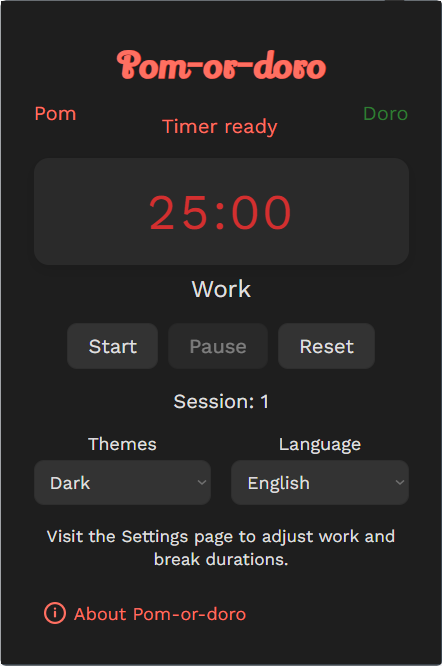
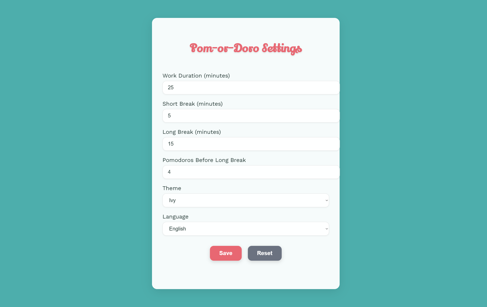

# Pom-or-doro Chrome Extension

🌟 **Overview**  
The Pom-or-doro Chrome Extension is your personalized productivity companion, designed to help you focus and take structured breaks using the popular Pomodoro Technique. What makes it unique is its blend of efficient functionality with a touch of Ethiopian cultural aesthetics and multilingual support, including Amharic.

The for the naming i used 'pom' which means apple, associated with healthy work-habits; while 'doro' which means chicken, associated with fun and break-time.

Stay on track with your tasks, receive timely notifications, and customize your experience with beautiful themes and sounds.

---

# Preview
.
.
.
## ✨ **Features**

- **Customizable Pomodoro Timer:** Set your ideal work and break durations.
- **Short & Long Breaks:** Differentiates between short and extended break periods.
- **Desktop Notifications:** Get timely alerts when your work session ends or it's time to get back to focus.
- **Flexible Settings:** Easily adjust session times, notification sounds, visual themes, and language preferences.
- **Multilingual Support:** Available in English and Amharic (አማርኛ) for a more personalized user experience.
- **Theming Options:** Choose from Light, Dark, or a specially curated Ethiopian-inspired theme to match your style.

---

## 🚀 Installation & Setup

**To get Pom-or-doro up and running on your Chrome browser:**

1. **Download or Clone:**  
   Get a copy of this repository to your local machine.
   ```bash
   git clone [repository-url]
   cd pom-or-doro-extension
   ```

2. **Install Dependencies:**  
   Open your terminal or command prompt in the project's root directory and install Sass:
   ```bash
   npm install
   ```

3. **Start Sass Watcher:**  
   Keep this command running in a separate terminal window during development. It automatically compiles your Sass files into CSS whenever you make changes.
   ```bash
   npm run sass:watch
   ```

4. **Load in Chrome:**
   - Open Google Chrome.
   - Navigate to `chrome://extensions`.
   - Toggle "Developer mode" on (usually in the top-right corner).
   - Click the "Load unpacked" button.
   - Select the `pom-or-doro-extension` folder (the root directory of this project).

Your extension should now appear in your Chrome extensions list and as an icon in your browser toolbar!

---

## 👨‍💻 Usage

- **Open the Timer:** Click the Pom-or-doro icon in your Chrome toolbar.
- **Control Your Sessions:**
  - Click "Start" to begin a work session.
  - Click "Pause" to temporarily stop the timer.
  - Click "Reset" to return the timer to its initial state for the current mode.
- **Customize Settings:** Click the "Settings" link within the popup to open the options page. Here, you can:
  - Adjust work, short break, and long break durations.
  - Choose your notification sound (standard or Amharic tone).
  - Select your preferred theme (Light, Dark, or Ethiopian).
  - Switch the extension's language between English and Amharic.

---

## 🛠️ Technologies Used

- **HTML5:** For structuring the popup and options pages.
- **JavaScript:** Powers the timer logic, background processes, user interaction, and settings management.
- **Sass (SCSS):** For organized, maintainable, and themeable styling.

---

## 💡 Future Enhancements

- **Ethiopian Numerals:** Implement the display of time using traditional Amharic numerals.
- **Advanced Reporting:** Track and visualize Pomodoro sessions over time.
- **Website Blocker:** Add an optional feature to block distracting websites during work sessions.
- **More Sounds & Themes:** Expand the library of culturally inspired notification sounds and visual themes.

---

## 🤝 Contributing

Contributions are welcome! If you have ideas for improvements, new features, or find any bugs, please feel free to open an issue or submit a pull request.

---

## 📄 License

This project is open-sourced under the MIT License.

---

We hope **Pom-or-doro** helps you stay focused and productive!